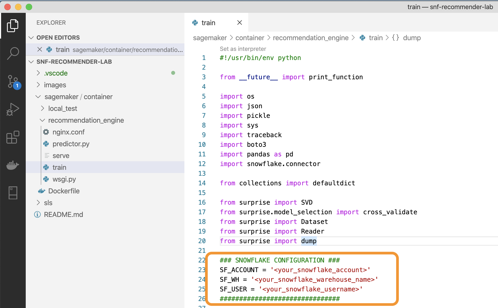
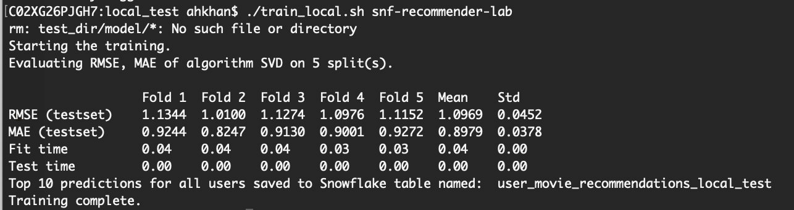
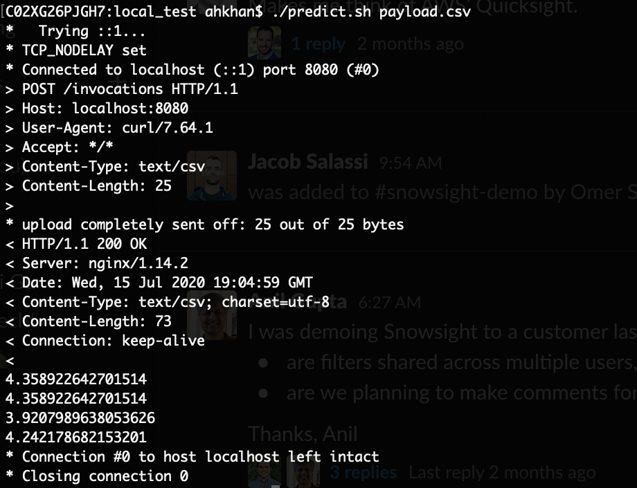
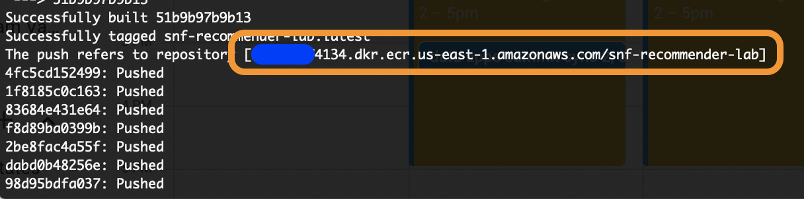

### Lab 2: Preparing Amazon SageMaker for Training & Model Deployment

In Amazon SageMaker, you have the option of using "built-in" algorithms or create your own custom algorithm using custom Docker images. In this lab, we will be using a single Docker image to package up our training and model inference code. Lets get started!

1. Open a terminal session and clone this repository, and change into the newly created directory: `git clone https://github.com/Snowflake-Labs/sfguide-recommender-pipeline.git && cd sfguide-recommender-pipeline/`

    Within this directory, you will see two sub-directories: `sagemaker` and `sls`. The `sagemaker` director contains all our trianing and deployment code while the `sls` director contains code & definitions for serverless lambda functions that we can call from within Snowflake to automate our pipeline.

2. Using your favorite IDE (mine is [VS Code](https://code.visualstudio.com/)), open this file: `/sfguide-recommender-pipeline/sagemaker/container/recommendation_engine/train`. This script contains all our training code. 

    Amazon SageMaker will run this `train` script when we tell it to run training. Feel free to explore the `train()` method within this script to see what is going on. At a high level, the `train()` method peforms the following steps: 
    - Retrieves a password from our credentials store (SSM).
    - Connects to our Snowflake account and loads up a Pandas dataframe from an input table.
    - Trains a collaborative filtering recommendation model using the Surprise library.
    - To calculate the top 10 recommendations for each user, it does bulk inference and stores the recommendaiton in an output table in Snowflake.
    - Save the model artifact in S3 so it can be deployed by SageMaker at a later time.

3. Go ahead and configure the connection setttings of your Snowflake account and save the changes:

    

4. Notice that the Snowflake account password is missing from the configuration. We should never store any password in code. Lets use AWS SSM to securely store our Snowflake password. Copy the command below, fill in your Snowflake password in the `value` field and run it in the terimal (do not change the name):

    ```bash
    aws ssm put-parameter \
        --name "snf_password" \
        --type "String" \
        --value "<your_snowflake_password>" \
    ```

**IMPORTANT**: If you are deploying this solution to a region other than `us-east-1`, please go ahead and update the `region` parameter in `/sagemaker/container/local_test/test_dir/input/config/hyperparameters.json` before you start testing locally.


5. If you want to inspect the model inference code, you can review the code in `predictor.py`.

6. Next, we are going to package this code up in a Docker image. In the terminal, switch to the `/sagemaker/container` directory and run: `docker build -t snf-recommender-lab:latest .`

    **Note:** it might take a few minutes to finish when you build this image for the first time.

7. In this lab, you are using code that is already developed but in a real-world development cycle, you will want to test this code locally to make sure it runs without any errors before we give it to SageMaker to run. For local testing, SageMaker provides us with a testing framework located within the `/sagemaker/container/local_test` directory. Lets switch to this directory and test the training code locally:

    `./train_local.sh snf-recommender-lab`

    You should see the results of the training in terms of RMSE (Root Mean Square Error) and other metrics:

    

    Let's see if we can use the power of Amazon SageMaker to train over a larger training set and improve the RMSE (lower is better).

8. Notice that at the end of the output above, it tells us the name of the output table where it stored the results of the bulk predictions (top 10 movie recommendations for each user). Run the following SQL to see these results in Snowflake:

    ```sql
    select * from user_movie_recommendations_local_test limit 10;
    ```

    Notice the top 10 movie recommendations are stored in a `VARIANT` type that can hold any arbirary JSON object. In this case, its an array of movie IDs.

9. Now let us test the inference code (implemented in `predictor.py`). For this, we will use another script in the `/sagemaker/container/local_test` directory called `serve_local.sh`. Run the following command:

    `./serve_local.sh snf-recommender-lab`

    This will start a test web server on your local machine. Go ahead and open a new terminal window and run:

    `./predict.sh payload.csv`

    The `payload.csv` has a few userid and movieid pairs for us to test the trained model. You should see the predicted ratings in the output:

    

    Notice we get four predicted ratings for four user/movie pairs in the `payload.csv` file. Our inference code works - nice!

10. Both training and inference work on our local machine. Now we can push the Docker image up to [ECR](https://aws.amazon.com/ecr/) so SageMaker can use it for training and deployment. Go ahead and switch to `sfguide-recommender-pipeline/sagemaker/container` and run:

    `./build_and_push.sh snf-recommender-lab`

    **Note:** this will take a while the first time you run this since the whole Docker image needs to be uploaded to ECR.

11. Note down the image name in the output as `training_image_ecr_path`. We will use this value in the next section.

    

### 👉 Continue to [Lab 3: Deploying AWS Lambda Functions & API Gateway Using Serverless Framework](LAB3.md)