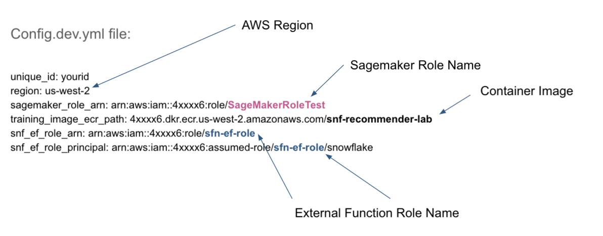

### Lab 3: Deploying AWS Lambda Functions & API Gateway Using Serverless Framework

In this lab we will provision an Amazon API Gateway and the AWS Lambda functions that will help integrate Snowflake with SageMaker. We will be using the [Serverless Framework](https://serverless.com) to help us programmatically define and provision this infrastructure.

#### IAM Role for SageMaker

1. First we need to create an AWS IAM role that will let SageMaker training jobs to access S3, ECR and other needed services on your behalf.

    Sign in to the AWS Management Console and open the IAM console at https://console.aws.amazon.com/iam/.

    In the left navigation pane, choose Roles.

2. Choose Create role. For role type, choose AWS Service, find and choose SageMaker, and then choose the SageMaker - Execution use case. Then choose Next: Permissions.

3. On the Attach permissions policy page, choose these managed policies:  `AmazonSageMakerFullAccess` .

4. Choose Next: Review and create the role. After creation, click back on the role you just created and click on the permissions tab

5. Click on Attach Policies, search for  `SSM` and pick the `AmazonSSMReadOnlyAccess` policy by checking the checkbox next to it and click on "Attach Policy"

6. Copy the `Role ARN` value.

7. In the IDE, open the `config.dev.yml` file within the `sls` folder and paste in the `Role ARN` value you copied in the last step for `sagemaker_role_arn` variable.

8. Paste in the value you noted down in the last step of LAB 2 for the `training_image_ecr_path` (this is the Docker image you pushed up to ECR).

9. Change the `region` if you are deploying to a different region. Save the `config.dev.yml` file.

#### IAM Role for Snowflake External Functions

Now we need to create a role in your AWS account that Snowflake can assume and invoke the API Gateway.

1. Create a new AWS IAM role: https://console.aws.amazon.com/iam/.

2. When asked to select the type of trusted entity, choose “Another AWS account”.

3. When asked to “Specify accounts that can use this role”, paste in your AWS account ID. Your AWS account ID is the number embedded in any of the ARNs we noted down in previous steps.

    

4. Click on “Next: Permissions”. No permissions are needed right now so just proceed to the next step.

5. Enter a role name. Record the role name as the `Snowflake External Function Role Name`. After you create the role: Record the `Role ARN` as the `Snowflake External Function Role ARN`.

6. Go back to the `config.dev.yml` file and fill the value for the `snf_ef_role_arn` variable with `Role ARN` you captured in the last step.

7. In `config.dev.yml`,  change the value for `unique_id` to your unique username. This is required to make sure the S3 bucket name is unique for your deployment. 

8. Fill out the `snf_ef_role_principal` with a value using this format:

    `arn:aws:sts::<12-digit-number>:assumed-role/<external_function_role>/snowflake` 

    Your `config.dev.yml` file should now look something like this:

    

#### Deploy the Serverless App (Lambda and API Gateway)

With the blanks filled out in the `config.dev.yml` file, now its time to deploy the API Gateway and Lambda Functions.

1. Go to the terminal/command line window, switch to the `sls` directory and issue the following command to deploy the infrastructure:

    `sls deploy`

    If everything goes smoothly, you should see an output summary listing out the resources created by the Serverless Framework in your AWS account:

    

#### Connect the API Gateway with Snowflake

Now that we have our Serverless infrastructure deployed, lets move over to the Snowflake UI and work on some SQL magic! 🧙🏼‍♀️

1. Log into the the Snowflake UI. We need to create API Intagrations and for this we need to work as an `ACCOUNTADMIN`:

    `use role ACCOUNTADMIN;`

    Also select the DB and schema for which you want to create this External Functions (I'm using TEST.PUBLIC):

    `use schema MOVIELENS.PUBLIC;`

2. Let's create the API integration object within Snowflake that will point to external API Gateway resource:

    ```sql
    create or replace api integration snf_recommender_api_integration
    api_provider = aws_api_gateway
    api_aws_role_arn = '<snf_ef_role_arn>'
    enabled = true
    api_allowed_prefixes = ('<https://api_endpoint_url>');
    ```

    Grab the value of `snf_ef_role_arn` from the `config.deg.yml` file. Get the endpoint URL from the Serverless output screen as the value for the `api_allowed_prefixes` field as highlighted in the screenshot below:

    

    Run the SQL above with the two values filled in to create the API integration object.

3. Now we need to setup trust between Snowflake and new AWS IAM role that we created earlier. Go ahead and run:

    `describe integration snf_recommender_api_integration`

4. In a separate tab, open the AWS console and navigate to find the IAM role you created earlier. Under the `Trust relationships` click on `Edit trust relationship`.

    

    Replace the JSON document with this one:

    ```json
    {
        "Version": "2012-10-17",
        "Statement": [
            {
            "Effect": "Allow",
            "Principal": {
                "AWS": "<API_AWS_IAM_USER_ARN>"
            },
            "Action": "sts:AssumeRole",
            "Condition": {"StringEquals": { "sts:ExternalId": "<API_AWS_EXTERNAL_ID>" }}
            }
        ]
    }
    ```

    And then replace the values of `API_AWS_IAM_USER_ARN` and `API_AWS_EXTERNAL_ID` with the corresponding values shown in the result of the `describe api integration` command in the last step.

    Click `Update Trust Policy`

### 👉 Continue to [Lab 4: Model Training, Deployment and Inference Using External Functions](LAB4.md)


