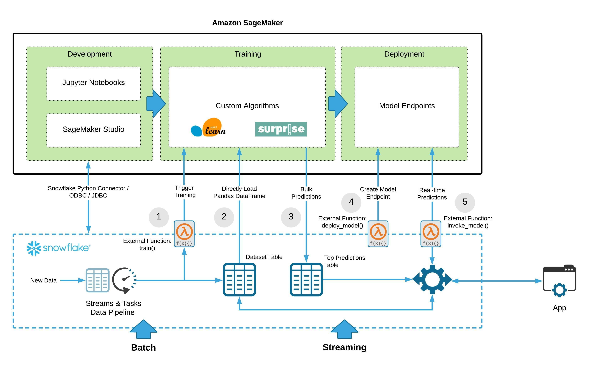

# Snowflake Guide: Machine Learning Model Training and Inference Using Snowflake External Functions and Amazon SageMaker

## ➡️ Complete this end-to-end tutorial on [guides.snowflake.com](https://guides.snowflake.com/guide/recommendation_engine_aws_sagemaker)

End-to-end lab showing how to train a recommendation system using Amazon SageMaker with data stored in Snowflake. External Functions in Snowflake let us call external API endpoints which can bring extensibility to your data pipelines. Using External Functions, this solution automates the training/re-training of the recommendation model as well as automated bulk inference and deployment of a real-time inference endpoint. Here is the architecture diagram:



For this lab, we will using the [MovieLens dataset](https://grouplens.org/datasets/movielens/) to build a movie recommendation system. We will use Snowflake as the dataset repository and Amazon SageMaker to train and deploy our Machine Learning model. The recommendations will be powered by the SVD algorithm provided by the [Surprise](http://surpriselib.com/) python library. Here is how the guide is structured:

* Lab 1: Load Dataset: downloading the dataset and loading it into Snowflake.
* Lab 2: Preparing Amazon SageMaker for Training & Model Deployment
* Lab 3: Deploying AWS Lambda Functions & API Gateway Using Serverless Framework
* Lab 4: Model Training, Deployment and Inference Using Snowflake External Functions

## PRE-REQUISITES ☑️

You will need the following development tools on your machine to complete this lab:

1. Snowflake account with `ACCOUNTADMIN` access. Get a free trial here: https://trial.snowflake.com/
2. AWS account with administrator access (or scoped IAM user with access to Lambda, API Gateway, SageMaker, AWS Systems Manager)
3. Docker Desktop: https://www.docker.com/products/docker-desktop
4. Serverless Framework: https://www.serverless.com/
5. Make sure you have the [AWS CLI version 2 installed](https://docs.aws.amazon.com/cli/latest/userguide/install-cliv2.html) and configured with credentials: https://docs.aws.amazon.com/cli/latest/userguide/cli-chap-configure.html

## STEP-BY-STEP GUIDE 👣

### Lab 1: Load Dataset


1. Download the small version of the dataset here and unzip it on your local machine: http://files.grouplens.org/datasets/movielens/ml-latest-small.zip

2. Sign in to Snowflake and run the following SQL statements to create the `Movies` and `Ratings` tables that we will load the dataset into:

    ```sql
    use role sysadmin;
    create database MOVIELENS;
    use schema movielens.public;
    
    CREATE OR REPLACE WAREHOUSE COMPUTE_WH WITH WAREHOUSE_SIZE = 'XSMALL' AUTO_SUSPEND = 60 AUTO_RESUME = TRUE;

    create table movies  (
        movieid int,
        title varchar,
        genres varchar
    );

    create or replace table ratings (
        userid int,
        movieid int,
        rating float,
        timestamp timestamp_ntz
    );
    ```

3. Using the Snowflake UI menu bar, switch over to the `Databases` tab and select the newly created `MOVIELENS` database.

    

    **Note:** Since this is small dataset, we can use the Snowflake UI to load this dataset into Snowflake. For larger datasets and automated loads, it is recommended that you use the Snowflake Snowpipe service, the `copy` command or partner ETL tools to load data.

4. Click on the `MOVIELENS` database and then select the `MOVIES` table. Once selected, click the `Load Data` button. Select an `XS` sized warehouse and hit `Next`.

5. Select `Load files from your computer` and browse to selec the `movies.csv` file on your local machine. Hit `next`.

6. On the next screen, we will specify a File Format that tells Snowflake how to parse the CSV file. We will create a new file format so click `+` button. Give the File Format a name, set the value of `Header lines to skip` to `1` and then change the `Field optionally enclosed by` to `Double Quote`. Click `Finish` and hit `Load` to load the `MOVIES` table.

    

7. Go back to step #4 👆and repeat the process to load data into the `RATINGS` table. This time, select the `ratings.csv` file on your local machine. No need to create a new File Format - you can use the existing one that you created in step #6.

8. Let's look at the data by running a quick select statement and also create a couple of small testing tables for when we test our SageMaker algorithm on our local machine:

    ```sql
    use warehouse COMPUTE_WH;
    select * from ratings limit 10;

    -- INPUT TABLE: small dataset for local testing 
    create table ratings_train_data_local_test as 
    (select USERID, MOVIEID, RATING from ratings limit 1000);

    -- OUTPUT TABLE: top 10 recommendations for local_testing
    create or replace table user_movie_recommendations_local_test 
    (USERID int, TOP_10_RECOMMENDATIONS variant);
    ```

Awesome, the data is now in Snowflake 👏🏼 and we can start dabbling in some machine learning code.

### Continue to 👉[Lab 2: Preparing Amazon SageMaker for Training & Model Deployment](LAB2.md)
